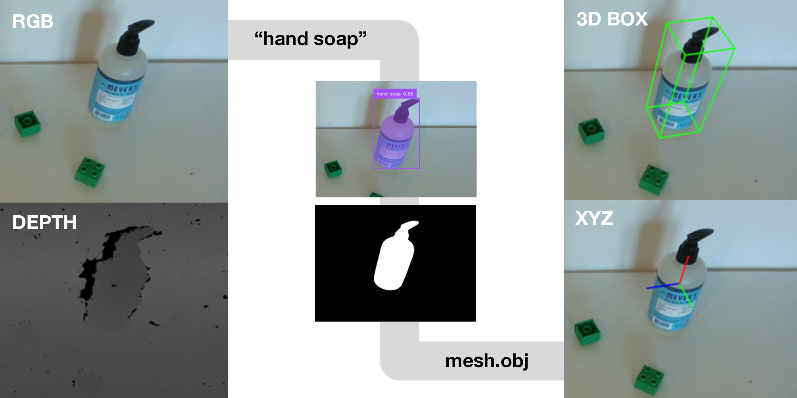

<h1 align="center">Build intelligent robots 🤖</h1>

[](https://docs.robot-learning.co/quickstart)
[](https://x.com/JannikGrothusen)

The goal of this API is to make AI-powered robotic automation accessible to anyone.

## Installation
```
git clone https://github.com/robot-learning-co/trlc-sdk.git && cd trlc-sdk
conda create -n trlc-sdk python=3.10 && conda activate trlc-sdk
pip install -e .
```

## Perception
Currently the perception API provides to endpoints:

1. **Grounded Segmentation** using [Grounded-SAM-2](https://github.com/IDEA-Research/Grounded-SAM-2) and
2. **6D Object Pose Estimation** using [FoundationPose](https://github.com/NVlabs/FoundationPose)

by combining these two we can extract the pose of any object from a RGB-D image:

<picture>
  
</picture>

You can find examples for these endpoints and their combination in [examples/](examples/). Check out the 